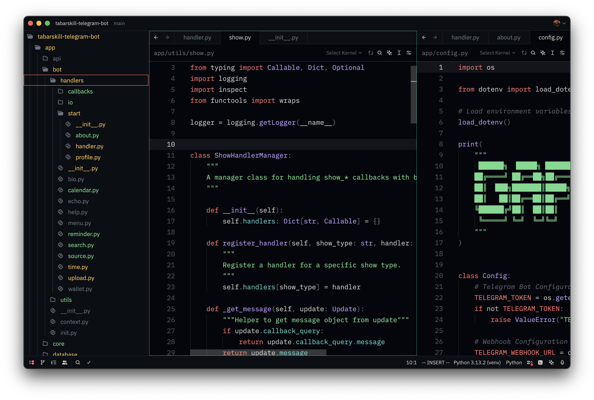

# Gafelson theme for Zed

A simple and pleasant dark theme for [Zed](https://zed.dev).

**This theme is also available for multiple different terminals [here](https://github.com/gafelson/gafelson-term-theme)**

## Screenshots

## Manual install

- Copy the `themes/*.json` files from this repo into `~/.config/zed/themes`.
- Select your theme (Settings -> Select Theme).
